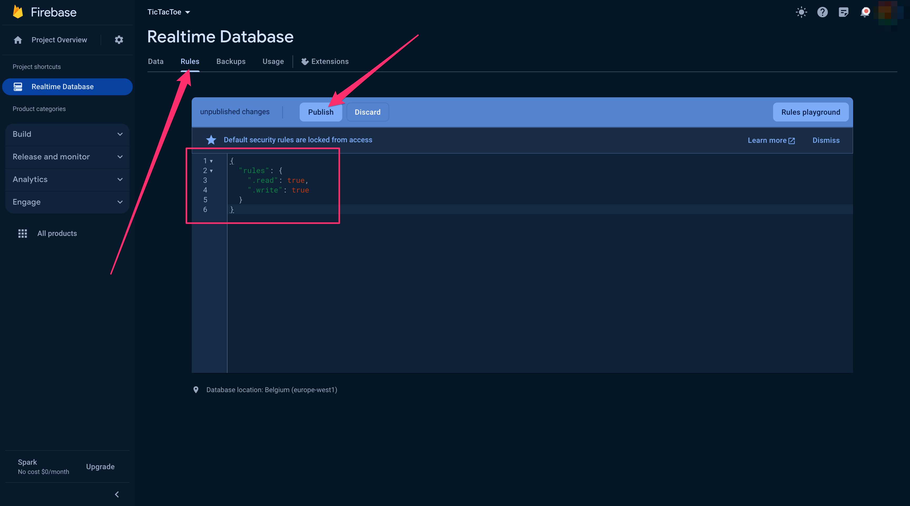
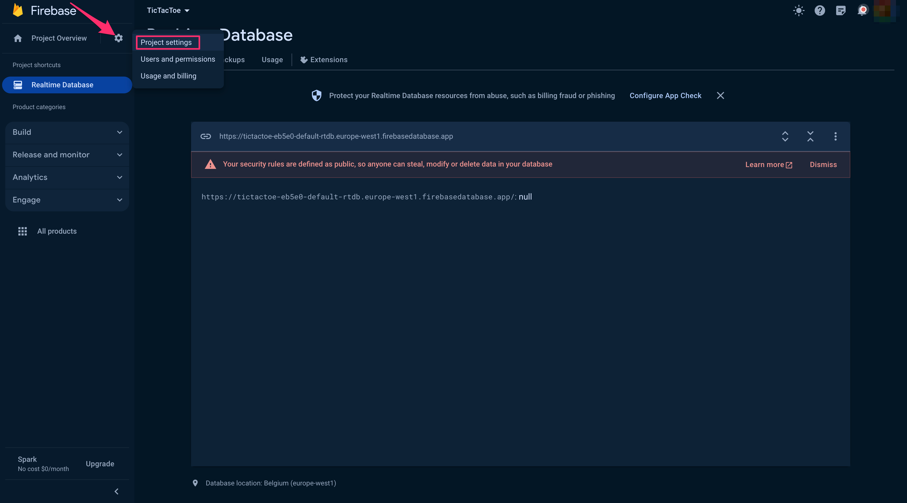

<h1 align="center">👾 Tic Tac Toe using Firebase Realtime Database</h1></br>
<p align="center">  
A Tic Tac Toe game Android app for playing in real time with two devices. Using Firebase, Compose and Hilt based on modern Android tech-stack and MVVM architecture.
</p>
</br>

<h3 align="center">🚧 IN PROGRESS 🚧</h2>

## Screenshots


## Tech stack
- 100% [Kotlin](https://kotlinlang.org/) based + [Coroutines](https://github.com/Kotlin/kotlinx.coroutines) + [Flow](https://kotlin.github.io/kotlinx.coroutines/kotlinx-coroutines-core/kotlinx.coroutines.flow/) for asynchronous.
- Hilt for dependency injection.
- Firebase: Realtime database.
- JetPack
  - Compose - A modern toolkit for building native Android UI.
  - Lifecycle - dispose observing data when lifecycle state changes.
  - ViewModel - UI related data holder, lifecycle aware.
- Architecture
  - Clean Architecture.
  - MVVM Architecture (Declarative View - ViewModel - Model)
- Material Design & Animations.

## Features
- Create game and copy the game ID to share it.
- Join a game with the game ID.
- Play the game.

## Future Features (Contributions are welcome!)
- Game history.
  
## How to - Build guide
For security reasons, I have not added the `google-services.json` file. This file is responsible for establishing the connection to the Firebase database. Here, I will explain how you can set up own Firebase Realtime database for FREE, download `google-services.json` and how to use it. This is necessary if you want to download and build this Android project.

1. Login to [firebase console](https://console.firebase.google.com/) and add a new project.
   
   

2. Give a name to the Firebase project.

   

3. If you want you can enable Google Analytics. Click `Continue`.

   

4. If you enabled Google Analytics select your preferred Google Analytics account and click `Create project`.

   

5. Wait until your project is ready and click `Continue`.

   

6. On your new Firebase project main screen click the Android icon to add Firebase to your Android app.

   

7. Register the app:
     - ⚠️ Make sure to specify `com.ft.tictactoe` as the package name. ⚠️
     - Optionally enter the nickname for the app.
     - Click `Register app`.
   
   

8. ⚠️ DO NOT DOWNLOAD THE JSON FILE YET. ⚠️ Just click continue, it will be downloaded later when all the config is set up.

   

9. The Firebase SDK is already added in this project. You can check if everything is fine just in case. Click `Next`.

    
    

10. Click `Continue to the console`.
    
    

11. On the main page of the Firebase project go to `Build > Realtime Database`.

    

12. On Realtime Database page click `Create Database`.

    

13. Choose your prefrerred location for the database and click `Next`.

    

14. Choose any option for the security rules and click `Enable`, we will edit this rules later.

    

15. Go to Rules tab and edit them specifying the following rules: Then click on `Publish`.
    ```
    {
      "rules": {
        ".read": true,
        ".write": true
      }
    }
    ```
    

16. Finally, go to `Project settings` and download the `google-services.json` file.

    
    

17. Last step: Add the downloaded file to your Android project under `TicTacToe > app > src` and build the project.

    

    
   

[//]: # (## Find this repository useful? :heart:)

[//]: # (Support it by joining __[stargazers]&#40;https://github.com/waleska404/tic-tac-toe/stargazers&#41;__ for this repository. :star: <br>)

[//]: # (And __[follow]&#40;https://github.com/waleska404&#41;__ me for my next creations! 🤓)
